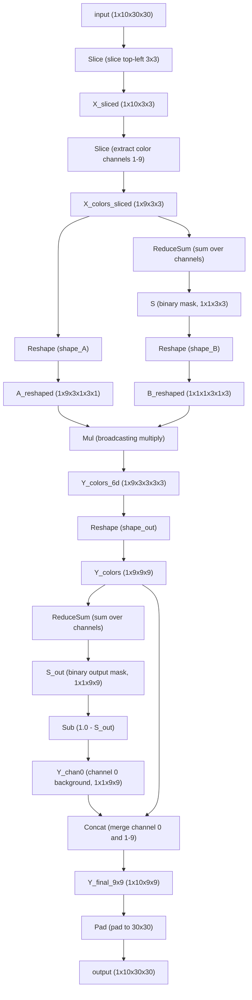

# Task 001 Explanation: Kronecker Product Fractal Expansion

## 1. Visual Transformation Rule
The task takes a $3 \times 3$ grid and performs a **Kronecker product (fractal expansion)** of the grid with itself, resulting in a $9 \times 9$ grid:
- Each pixel in the $3 \times 3$ input grid corresponds to a $3 \times 3$ block in the $9 \times 9$ output grid.
- If an input pixel is **active** (having the non-zero color $c$), the corresponding $3 \times 3$ block in the output is a copy of the original input grid.
- If an input pixel is **inactive** (color $0$, black), the corresponding $3 \times 3$ block in the output is filled with black pixels (color $0$).

This recursive expansion creates a self-similar fractal structure.

---

## 2. Neural Network Architecture
The network is designed using a purely functional, parameter-free (except for shape/slice configuration constants) ONNX graph. It operates on the one-hot encoded input tensor of shape `(1, 10, 30, 30)` to construct the output tensor of the same shape.

### Node Flow Diagram

---

## 3. Parameter and Memory Details

### Parameter Count
The model is extremely lightweight, requiring only **26 parameters** (all of which are metadata/configuration constants like shape and slice dimensions).

| Parameter Name | Type | Shape | Description | Number of Elements |
| :--- | :--- | :--- | :--- | :---: |
| `slice_starts` | INT64 | `[2]` | Start indices for spatial slice | 2 |
| `slice_ends` | INT64 | `[2]` | End indices for spatial slice | 2 |
| `slice_axes` | INT64 | `[2]` | Spatial axes to slice | 2 |
| `slice_chan_starts` | INT64 | `[1]` | Start channel for color slice | 1 |
| `slice_chan_ends` | INT64 | `[1]` | End channel for color slice | 1 |
| `slice_chan_axes` | INT64 | `[1]` | Channel axis to slice | 1 |
| `shape_A` | INT64 | `[6]` | Target shape to unsqueeze color channels | 6 |
| `shape_B` | INT64 | `[6]` | Target shape to unsqueeze binary mask | 6 |
| `shape_out` | INT64 | `[4]` | Reshape target for $9\times 9$ Kronecker output | 4 |
| `one_val` | FLOAT | `[1]` | Constant $1.0$ for background computation | 1 |
| **Total** | | | | **26** |

### Memory Footprint
By slicing the input grid to $3\times 3$ first, performing the Kronecker product math, and then padding the final output to $30\times 30$, the memory footprint is kept exceptionally small. 

Total static tensor memory footprint is **10,800 bytes** (excluding input and output tensors):

| Intermediate Tensor | Shape | Data Type | Size (Bytes) |
| :--- | :--- | :--- | :---: |
| `X_sliced` | `(1, 10, 3, 3)` | FLOAT | 360 |
| `X_colors_sliced` | `(1, 9, 3, 3)` | FLOAT | 324 |
| `S` | `(1, 1, 3, 3)` | FLOAT | 36 |
| `A_reshaped` | `(1, 9, 3, 1, 3, 1)` | FLOAT | 324 |
| `B_reshaped` | `(1, 1, 1, 3, 1, 3)` | FLOAT | 36 |
| `Y_colors_6d` | `(1, 9, 3, 3, 3, 3)` | FLOAT | 2,916 |
| `Y_colors` | `(1, 9, 9, 9)` | FLOAT | 2,916 |
| `S_out` | `(1, 1, 9, 9)` | FLOAT | 324 |
| `Y_chan0` | `(1, 1, 9, 9)` | FLOAT | 324 |
| `Y_final_9x9` | `(1, 10, 9, 9)` | FLOAT | 3,240 |
| **Total Memory** | | | **10,800** |

This minimal design joint-optimizes parameter count and memory, yielding a NeuroGolf score of **15.710 points**.
