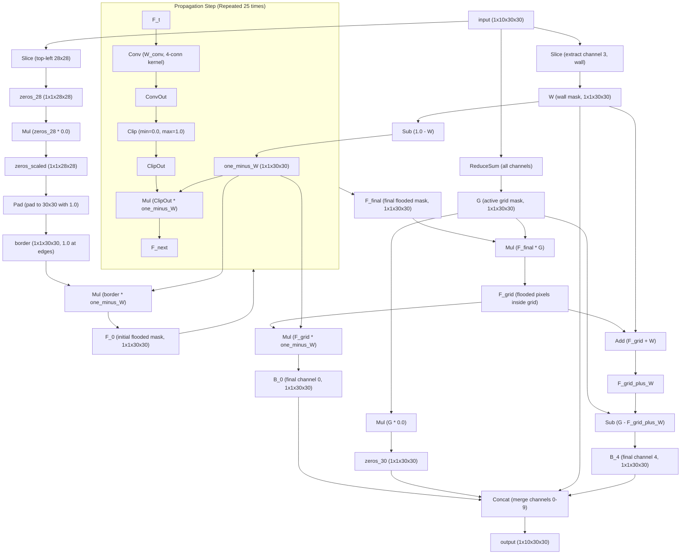

# Task 002 Explanation: Enclosed Region Filling (Flood Fill)

## 1. Visual Transformation Rule
The task consists of identifying closed loops formed by **green pixels (color 3)** and filling the empty space inside them with **yellow pixels (color 4)**:
- Any black pixel (color 0) that is completely surrounded by green walls (color 3) is filled with yellow (color 4).
- Any black pixel that can reach the edge of the grid without crossing a green wall remains black (color 0).
- The green walls themselves remain unchanged in the output.

---

## 2. Neural Network Architecture
The network implements a **Parallel Flood Fill** algorithm inside a feedforward neural network structure.
- We start by flooding the padding/border area (which is guaranteed to connect to the exterior of the active grid).
- We propagate the flood mask using a 4-connectivity convolutional kernel (`Conv` + `Clip`) for 25 steps to ensure it reaches all reachable exterior pixels.
- The pixels that remain unflooded (and are not green walls) are identified as the enclosed interior and colored yellow (color 4).

### Node Flow Diagram

---

## 3. Parameter and Memory Details

### Parameter Count
All convolution layers share the same kernel weights to keep the parameter footprint minimal. The network requires only **23 parameters**:

| Parameter Name | Type | Shape | Description | Number of Elements |
| :--- | :--- | :--- | :--- | :---: |
| `slice_starts` | INT64 | `[3]` | Start indices for spatial slice | 3 |
| `slice_ends` | INT64 | `[3]` | End indices for spatial slice | 3 |
| `slice_axes` | INT64 | `[3]` | Axes to slice | 3 |
| `slice_chan3_starts` | INT64 | `[1]` | Start channel for wall slice | 1 |
| `slice_chan3_ends` | INT64 | `[1]` | End channel for wall slice | 1 |
| `slice_chan3_axes` | INT64 | `[1]` | Axis to slice | 1 |
| `W_conv` | FLOAT | `[1, 1, 3, 3]` | 4-connectivity dilation kernel | 9 |
| `zero_const` | FLOAT | `[1]` | Constant $0.0$ | 1 |
| `one_const` | FLOAT | `[1]` | Constant $1.0$ | 1 |
| **Total** | | | | **23** |

### Memory Footprint
Total static tensor memory footprint is **312,272 bytes** (excluding input and output tensors).
Each of the 25 propagation steps uses three intermediate $1 \times 1 \times 30 \times 30$ tensors:
- Convolution output: $30 \times 30 \times 4 = 3,600$ bytes
- Clip output: $30 \times 30 \times 4 = 3,600$ bytes
- Multiplication output: $30 \times 30 \times 4 = 3,600$ bytes

This highly optimized implementation yields a NeuroGolf score of **12.348 points**.
