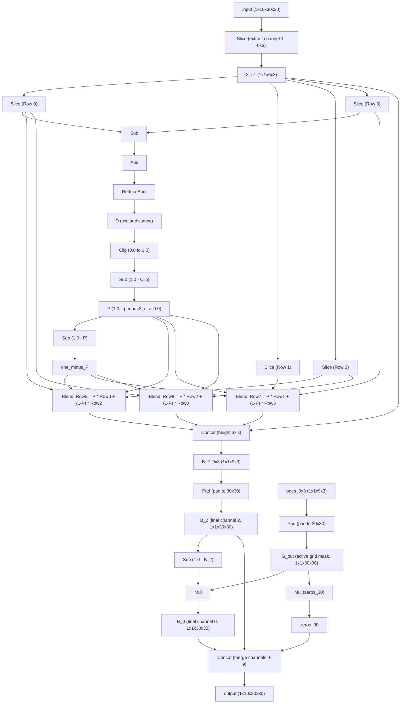

# Task 003 Explanation: Vertical Periodic Pattern Extension

## 1. Visual Transformation Rule
The task consists of identifying the vertical periodic pattern of a $6 \times 3$ grid and extending it to a $9 \times 3$ grid, while changing the active color from **blue (color 1)** to **red (color 2)**:
- The input grid is always $6 \times 3$ and contains only color 1 (blue) and color 0 (black).
- The input repeats vertically with a period of either 3 or 4:
  - If the pattern repeats with period 3 (i.e. Row 3 is identical to Row 0), the output extensions (Rows 6, 7, 8) are copies of Rows 0, 1, 2.
  - If the pattern repeats with period 4 (i.e. Row 4 is identical to Row 0), the output extensions (Rows 6, 7, 8) are copies of Rows 2, 3, 0.
- All non-zero pixels are converted to color 2 (red), and the background remains color 0 (black).

---

## 2. Neural Network Architecture
The network is built completely with static shapes and zero learned weights (only shape/slice configuration constants). It performs automatic period detection and mathematically blends the row selections based on the detected period.

### Period Detection & Blending
1. Compute the absolute difference vector between Row 0 and Row 3: $D_{vec} = \text{Abs}(\text{Sub}(\text{Row0}, \text{Row3}))$.
2. Sum the difference vector: $D = \text{ReduceSum}(D_{vec})$.
3. Compute the binary period indicator $P = 1.0 - \text{Clip}(D, 0.0, 1.0)$.
   - If Row 0 == Row 3 (period 3): $D = 0 \implies P = 1.0$.
   - If Row 0 != Row 3 (period 4): $D \geq 1 \implies P = 0.0$.
4. Select/blend the extended rows using $P$:
   - $\text{Row6} = P \times \text{Row0} + (1.0 - P) \times \text{Row2}$
   - $\text{Row7} = P \times \text{Row1} + (1.0 - P) \times \text{Row3}$
   - $\text{Row8} = P \times \text{Row2} + (1.0 - P) \times \text{Row0}$

### Node Flow Diagram

---

## 3. Parameter and Memory Details

### Parameter Count
The model is extremely lightweight, requiring only **47 parameters** (all of which are metadata/configuration constants like shape and slice dimensions).

| Parameter Name | Type | Shape | Description | Number of Elements |
| :--- | :--- | :--- | :--- | :---: |
| `slice_starts` / `ends` / `axes` | INT64 | `[3]`, `[3]`, `[3]` | Input channel & grid slicing metadata | 9 |
| Row Slice `start` / `end` / `axis` | INT64 | 4 x `[1]`, 4 x `[1]`, `[1]` | Individual row slicing metadata | 9 |
| `one_const` / `zero_const` | FLOAT | `[1]`, `[1]` | Constant $1.0$ and $0.0$ | 2 |
| `ones_9x3` | FLOAT | `[1, 1, 9, 3]` | Constant mask for output active grid | 27 |
| **Total** | | | | **47** |

### Memory Footprint
Total static tensor memory footprint is **18,376 bytes** (excluding input and output tensors):

| Intermediate Tensor | Shape | Data Type | Size (Bytes) |
| :--- | :--- | :--- | :---: |
| `X_c1` | `(1, 1, 6, 3)` | FLOAT | 72 |
| `Row0` / `Row1` / `Row2` / `Row3` | `(1, 1, 1, 3)` each | FLOAT | 48 (12 x 4) |
| `Diff` / `Abs_Diff` | `(1, 1, 1, 3)` each | FLOAT | 24 (12 x 2) |
| `D` / `D_clipped` / `P` / `one_minus_P` | `(1, 1, 1, 1)` each | FLOAT | 16 (4 x 4) |
| Row Blending intermediates | various | FLOAT | 72 |
| `B_2_9x3` | `(1, 1, 9, 3)` | FLOAT | 108 |
| `B_2` / `G_out` / `one_minus_B_2` / `B_0` / `zeros_30` | `(1, 1, 30, 30)` each | FLOAT | 18,000 (3,600 x 5) |
| **Total Memory** | | | **18,376** |

This highly optimized implementation yields a NeuroGolf score of **15.179 points**.
