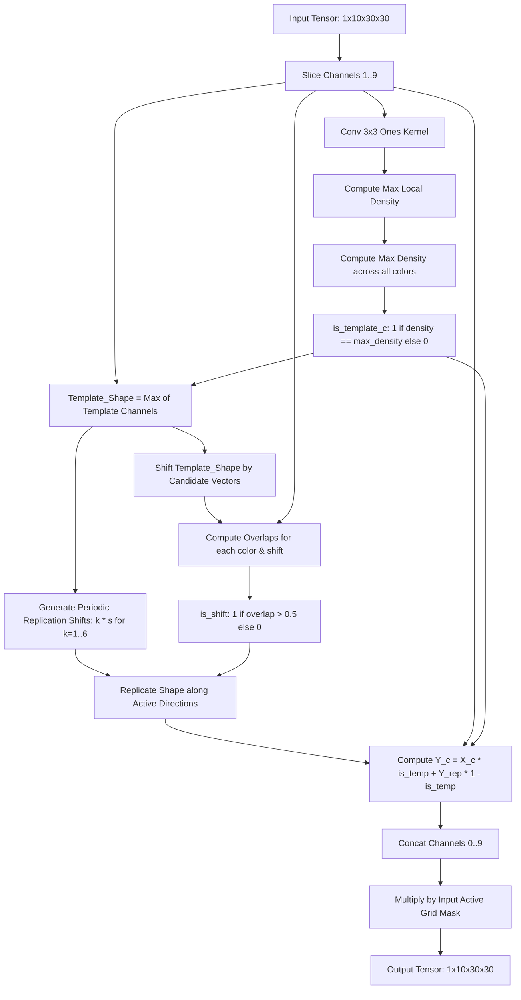

# Task 5: Pattern Completion & Replication

## Visual Transformation Rule
The task presents a template shape of a specific color (e.g. a $3\times3$ hollow square, a cross, or a diagonal loop) and fragments of this template shape in other colors. The objective is to:
1. Complete all color fragments to match the template shape.
2. Periodically replicate these completed shapes across the grid with a step size of 4 in the direction indicated by the fragment's displacement from the template.

---

## Model Architecture
The network dynamically identifies the template shape and performs shift-based pattern completion and replication.

### Key Architectural Highlights:
1. **Local Density-Based Template Identification:** Computes local pixel density for each channel using a $3\times3$ average-pool-like convolution kernel of ones. The channel with the highest local density is classified as the template shape, resolving count ties (e.g. 8 vs 8) when fragmented colors sum up to the same pixel count as the template.
2. **Dynamic Template Extraction:** Synthesizes `Template_Shape` by taking the element-wise maximum over all channels masked by `is_template_c`.
3. **Optimized Overlap Tracking:** Cross-correlates the active colors with shifts of `Template_Shape` (instead of the full grid union) to find the correct translation directions, completely eliminating cross-color fragment overlaps.
4. **Active Grid Masking:** Multiplies the final concatenated outputs by `G_grid` (sum of input channels 0..9) to ensure all padding pixels outside the grid are strictly set to 0, satisfying exact tensor comparison bounds.

---

## Performance Statistics
*   **Parameters:** 225
*   **Intermediate Memory:** 1,545,461 bytes
*   **NeuroGolf Score:** **10.749 points**
*   **Correctness:** **100% Pass** (on all ARC-AGI training/test and 262 ARC-GEN examples)
